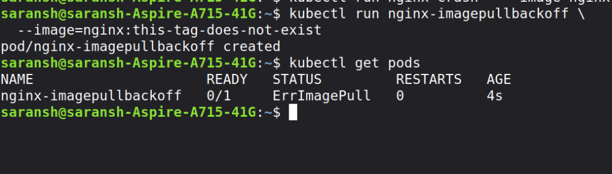
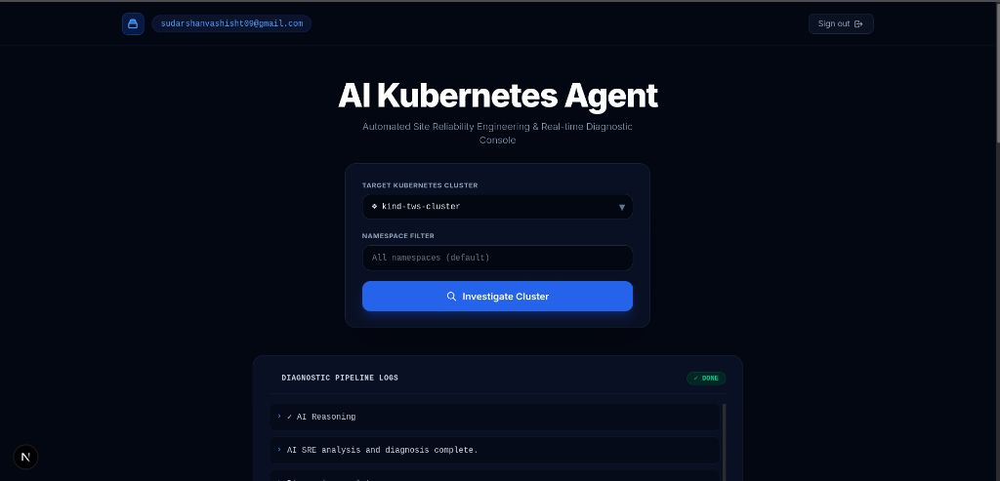
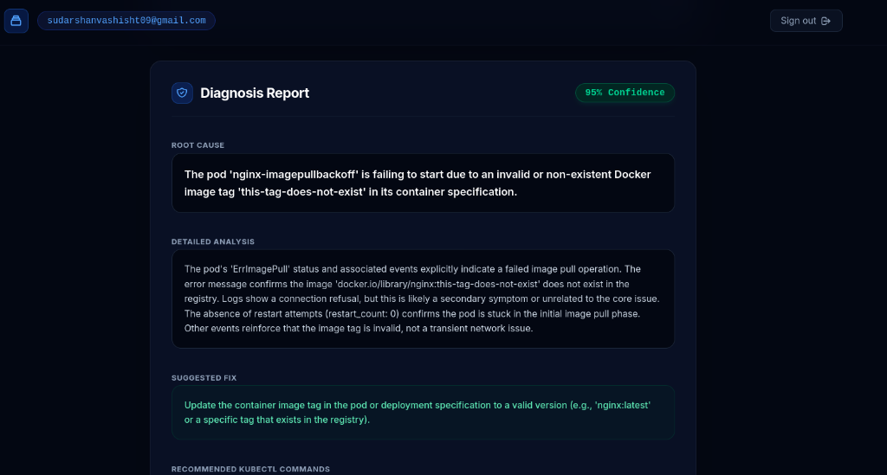
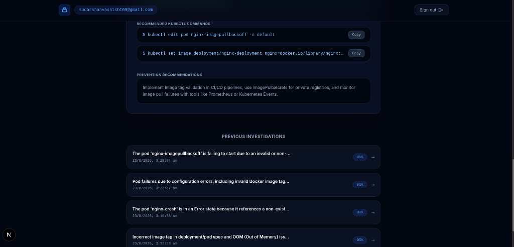
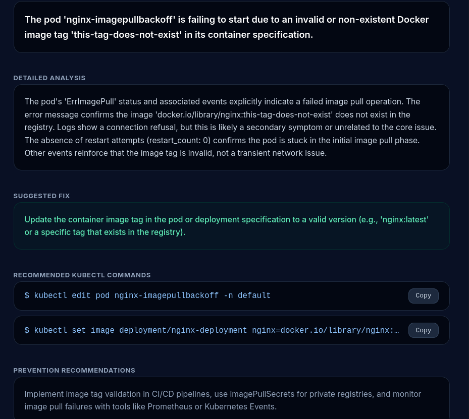
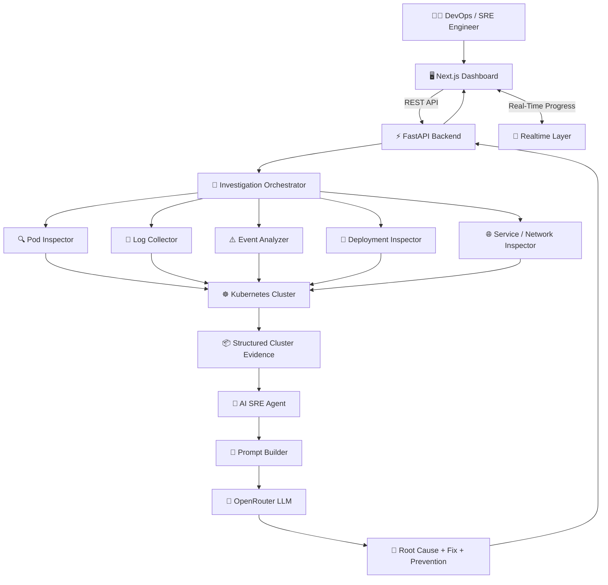
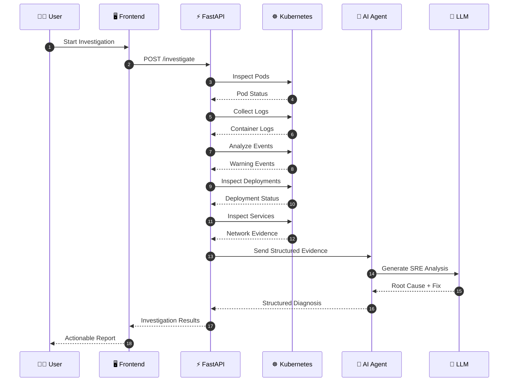
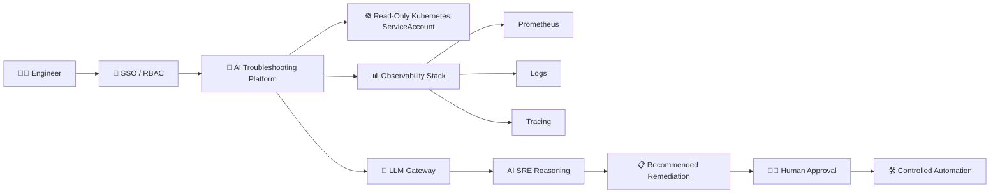

# 🤖 Kubernetes AI Troubleshooting Agent

<div align="center">Your AI-Powered SRE for Kubernetes Incidents ⚡

Detect failures • Collect evidence • Analyze root causes • Generate safe remediation • Prevent recurrence

<br/>

[](https://kubernetes.io/)
[](https://fastapi.tiangolo.com/)
[](https://nextjs.org/)
[](https://www.python.org/)
[](https://www.docker.com/)
[](https://openrouter.ai/)

</div>

---

## 🔥 The Problem

When Kubernetes breaks, engineers often jump between:

*   `kubectl get pods`
*   `kubectl describe pod`
*   `kubectl logs`
*   `kubectl get events`
*   `kubectl get deployments`
*   `kubectl get services`

Then comes the hardest part: correlating everything to find the actual root cause.

This project automates that investigation. 🤖

The Kubernetes AI Troubleshooting Agent acts like an intelligent SRE assistant that automatically inspects your Kubernetes environment, collects relevant evidence, correlates failures, and uses AI to generate an actionable diagnosis.

```text
Kubernetes Incident
        │
        ▼
 🔍 Collect Evidence
        │
        ▼
  🧠 AI SRE Analysis
        │
        ▼
 🎯 Root Cause Detection
        │
        ▼
 🛠️ Actionable kubectl Fix
        │
        ▼
 🛡️ Prevention Strategy
```

---

## 🚀 Why This Project Stands Out

«This is not just a chatbot connected to Kubernetes.»

The platform follows a more production-oriented troubleshooting model:

*   🔍 Deterministic Kubernetes evidence collection
*   📊 Multi-signal failure correlation
*   🧠 LLM-powered SRE reasoning
*   ⚡ Real-time investigation progress
*   🎯 Root cause + confidence scoring
*   🛠️ Actionable remediation commands
*   🛡️ Prevention recommendations
*   📚 Investigation history
*   🐳 Dockerized deployment
*   🧪 Built-in Kubernetes failure scenarios

---

## 🖥️ Product Preview

### 💥 Kubernetes Failure Scenario
The project includes intentionally broken Kubernetes workloads to simulate real production incidents.



---

### 🎛️ Cluster Investigation Dashboard
Select the target cluster and namespace, then trigger an AI-powered investigation.



---

### 🧠 AI-Powered Root Cause Analysis
The agent transforms raw Kubernetes signals into a structured SRE diagnosis.



---

### 🛠️ Actionable "kubectl" Remediation
Instead of only explaining the issue, the system provides practical remediation commands.



---

### 🛡️ Prevention & Investigation History
Every investigation can provide prevention guidance and maintain historical troubleshooting context.



---

## 🏗️ Architecture



---

## 🔄 How It Works



---

## 🧠 Investigation Engine

The investigation pipeline follows an SRE-style evidence collection model.

```text
┌─────────────────────────────────────┐
│         1. POD HEALTH CHECK         │
│ CrashLoopBackOff • OOMKilled        │
│ ImagePullBackOff • Pending • Error  │
└──────────────────┬──────────────────┘
                   ▼
┌─────────────────────────────────────┐
│         2. LOG COLLECTION           │
│ Failed Containers • Error Patterns  │
└──────────────────┬──────────────────┘
                   ▼
┌─────────────────────────────────────┐
│         3. EVENT ANALYSIS           │
│ Warning Events • Scheduling Issues  │
└──────────────────┬──────────────────┘
                   ▼
┌─────────────────────────────────────┐
│      4. DEPLOYMENT INSPECTION       │
│ Desired vs Available Replicas       │
└──────────────────┬──────────────────┘
                   ▼
┌─────────────────────────────────────┐
│      5. SERVICE / NETWORK CHECK     │
│ Service Selectors • Endpoints       │
└──────────────────┬──────────────────┘
                   ▼
┌─────────────────────────────────────┐
│         6. AI SRE REASONING         │
│ Correlation • Diagnosis • Fix       │
└─────────────────────────────────────┘
```

---

## ✨ Core Features

### 🔍 Automated Kubernetes Troubleshooting
The agent investigates common Kubernetes failure patterns, including:

| Failure | Investigation |
| :--- | :--- |
| 🔴 **CrashLoopBackOff** | Container status, logs, restart patterns |
| 📦 **ImagePullBackOff** | Image name, tag, registry-related events |
| 💥 **OOMKilled** | Memory limits and resource-related signals |
| ⏳ **Pending** | Scheduling and cluster resource events |
| ❌ **Application Errors** | Failed container logs and Kubernetes events |
| 🚀 **Deployment Failures** | Desired vs available replicas |
| 🌐 **Service Issues** | Selector and service configuration |

---

### 🧠 AI-Powered SRE Reasoning
Raw Kubernetes data is useful, but correlating it correctly is the real challenge.

The AI agent receives structured evidence and produces:

```text
🎯 ROOT CAUSE
     ↓
🔬 TECHNICAL EXPLANATION
     ↓
🛠️ RECOMMENDED FIX
     ↓
⌨️ EXECUTABLE kubectl COMMANDS
     ↓
🛡️ PREVENTION STRATEGY
     ↓
📊 CONFIDENCE SCORE
```

---

### ⚡ Real-Time Investigation Experience
The user can track investigation progress through the troubleshooting pipeline:

*   ✓ Connecting to Kubernetes Cluster
*   ✓ Inspecting Pod Health
*   ✓ Collecting Failed Container Logs
*   ✓ Analyzing Kubernetes Events
*   ✓ Inspecting Deployments
*   ✓ Checking Services and Networking
*   ✓ Running AI SRE Analysis
*   ✓ Investigation Complete

---

### 📚 Investigation History
The application supports investigation persistence, allowing users to review previous troubleshooting sessions and build operational context over time.

---

## 🧩 Technology Stack

| Layer | Technology |
| :--- | :--- |
| 🖥️ **Frontend** | Next.js + React + TypeScript |
| 🎨 **UI** | Tailwind CSS |
| ⚡ **Backend** | FastAPI + Python |
| ☸️ **Kubernetes** | `kubectl` + kubeconfig |
| 🧠 **AI** | OpenRouter-compatible LLM |
| 📡 **Realtime** | InsForge Realtime |
| 🔐 **Authentication** | InsForge Auth |
| 💾 **History** | Database integration + local fallback |
| 🔗 **HTTP** | Axios + HTTPX |
| 🐳 **Containers** | Docker + Docker Compose |

---

## 📁 Project Structure

```text
Kubernetes-AI-Troubleshooting-Agent/
│
├── frontend/
│   ├── src/
│   │   ├── app/                  # Pages and UI
│   │   ├── services/             # Backend API integration
│   │   ├── hooks/                # Authentication logic
│   │   └── types/                # TypeScript models
│   ├── Dockerfile
│   └── package.json
│
├── backend/
│   ├── app/
│   │   ├── api/                  # API endpoints
│   │   ├── ai/                   # AI agent + prompts + LLM client
│   │   ├── core/                 # Configuration
│   │   ├── kubernetes/           # Kubernetes inspection modules
│   │   ├── models/               # Pydantic schemas
│   │   └── services/             # Investigation orchestration
│   ├── Dockerfile
│   └── requirements.txt
│
├── k8s-test-scenarios/
│   ├── 01-crashloop-missing-env.yaml
│   ├── 02-imagepull-invalid-tag.yaml
│   ├── 03-oom-memory-limit.yaml
│   └── 04-service-selector-mismatch.yaml
│
├── docs/
│   ├── architecture.md
│   └── assets/
│       ├── 01-k8s-failure.png
│       ├── 02-dashboard-cluster.png
│       ├── 03-diagnosis-report.png
│       ├── 04-kubectl-commands.png
│       └── 05-prevention-history.png
│
└── docker-compose.yml
```

---

## ⚙️ Quick Start

### Prerequisites
Make sure you have:
*   Docker + Docker Compose
*   Access to a Kubernetes cluster
*   A valid `kubeconfig`
*   OpenRouter API key
*   Node.js 20+ (for local frontend development)
*   Python 3.11+ (for local backend development)

---

### 1️⃣ Clone the Repository
```bash
git clone <your-repository-url>
cd Kubernetes-AI-Troubleshooting-Agent
```

---

### 2️⃣ Configure the Backend
Create `backend/.env` and add your configuration:
```env
OPENROUTER_API_KEY=your_openrouter_api_key
OPENROUTER_MODEL=your_model_name
KUBECONFIG_PATH=~/.kube/config
```
*«🔐 Never commit API keys, kubeconfig files, or production credentials.»*

---

### 3️⃣ Verify Kubernetes Access
Before starting the application, make sure the backend has permission to inspect resources:
```bash
kubectl config get-contexts
kubectl cluster-info
kubectl get pods -A
```

---

### 4️⃣ Start the Application
```bash
docker compose up --build
```
Once started:
*   🖥️ **Frontend** → http://localhost:3000
*   ⚡ **Backend**  → http://localhost:8001

---

## 🧪 Test the AI Agent
The repository includes realistic failure scenarios for testing.

### 💥 Scenario 1 — CrashLoopBackOff
Missing environment configuration causes the application to fail repeatedly.
```bash
kubectl apply -f k8s-test-scenarios/01-crashloop-missing-env.yaml
```

---

### 📦 Scenario 2 — ImagePullBackOff
An invalid image tag causes Kubernetes to fail while pulling the container image.
```bash
kubectl apply -f k8s-test-scenarios/02-imagepull-invalid-tag.yaml
```

---

### 💥 Scenario 3 — OOMKilled
The workload exceeds its configured memory limits.
```bash
kubectl apply -f k8s-test-scenarios/03-oom-memory-limit.yaml
```

---

### 🌐 Scenario 4 — Service Selector Mismatch
A service cannot correctly route traffic because its selectors do not match the workload.
```bash
kubectl apply -f k8s-test-scenarios/04-service-selector-mismatch.yaml
```

---

### 🧹 Cleanup
```bash
kubectl delete -f k8s-test-scenarios/
```

---

## 🔌 API Overview

### Health Check
```http
GET /health
```

---

### Get Available Clusters
```http
GET /clusters
```

---

### Run an Investigation
```http
POST /investigate
Content-Type: application/json
```
Example request body:
```json
{
  "namespace": "default",
  "context": "your-kubernetes-context",
  "investigation_id": "incident-001"
}
```

---

## 🧠 AI Diagnosis Output
The system is designed to generate a structured JSON response like:
```json
{
  "root_cause": "Primary failure identified from cluster evidence",
  "explanation": "Technical explanation of the incident",
  "fix": "Recommended remediation",
  "kubectl_commands": [
    "kubectl ..."
  ],
  "prevention": "Recommended measures to prevent recurrence",
  "confidence": 95,
  "confidence_reasoning": "Evidence supporting the diagnosis"
}
```
This makes the output easier to render in the UI, persist as investigation history, and potentially integrate into future automation workflows.

---

## 🛡️ Production-Grade SRE Recommendations
The current project provides a strong foundation. For a production environment, the recommended architecture should evolve toward:



### Recommended Hardening
*   🔐 Use Kubernetes ServiceAccounts instead of developer kubeconfigs
*   🛡️ Apply least-privilege RBAC
*   🚫 Restrict cluster write permissions
*   👤 Add authentication and authorization to backend APIs
*   🔑 Store secrets in a dedicated secrets manager
*   📜 Maintain audit logs for every investigation
*   📊 Add Prometheus metrics and OpenTelemetry tracing
*   ⏱️ Add API timeouts and rate limiting
*   🧹 Sanitize logs before sending sensitive data to external AI providers
*   👨‍💻 Require human approval before executing remediation commands

---

## ⚠️ Safety Model

| AI CAN | AI SHOULD NOT AUTONOMOUSLY |
| :--- | :--- |
| ✓ Read cluster evidence | ✗ Delete production workloads |
| ✓ Correlate failures | ✗ Modify RBAC |
| ✓ Identify likely root causes | ✗ Rotate secrets |
| ✓ Explain incidents | ✗ Scale critical services |
| ✓ Recommend remediation | ✗ Execute destructive commands |
| ✓ Generate kubectl commands | |

*«The AI should investigate and recommend. Humans should control production changes.»*

**👨‍💻 Human Approval Required**

---

## 🗺️ Roadmap

- [ ] Multi-cluster investigations
- [ ] Kubernetes-native ServiceAccount authentication
- [ ] Least-privilege RBAC templates
- [ ] Prometheus integration
- [ ] Grafana integration
- [ ] Loki log correlation
- [ ] Distributed tracing support
- [ ] Incident severity classification
- [ ] Automated runbook retrieval
- [ ] Slack / PagerDuty notifications
- [ ] Human-approved remediation workflows
- [ ] Investigation report export
- [ ] OpenTelemetry instrumentation
- [ ] Expanded unit and integration tests

---

## 🎯 Engineering Philosophy

```text
┌──────────────┐
│   OBSERVE    │
└──────┬───────┘
       ▼
┌──────────────┐
│   COLLECT    │
│   EVIDENCE   │
└──────┬───────┘
       ▼
┌──────────────┐
│  CORRELATE   │
│   SIGNALS    │
└──────┬───────┘
       ▼
┌──────────────┐
│ AI REASONING │
└──────┬───────┘
       ▼
┌──────────────┐
│ ROOT CAUSE   │
└──────┬───────┘
       ▼
┌──────────────┐
│ SAFE ACTION  │
└──────┬───────┘
       ▼
┌──────────────┐
│  PREVENTION  │
└──────────────┘
```

---

## 🏆 The Goal

*«Reduce the time between "Something is broken" and "We know exactly why and what to do next."»*

This project combines Kubernetes automation, backend orchestration, real-time UX, and AI reasoning to create an intelligent troubleshooting workflow inspired by how experienced DevOps and SRE engineers investigate incidents.

---

<div align="center">

🤖 **Kubernetes AI Troubleshooting Agent**

Diagnose Faster. Debug Smarter. Operate Kubernetes with AI. 🔥

Built for DevOps Engineers • SREs • Platform Engineers • Kubernetes Teams

---

⭐ If this project helps you, consider giving it a star!

</div>
